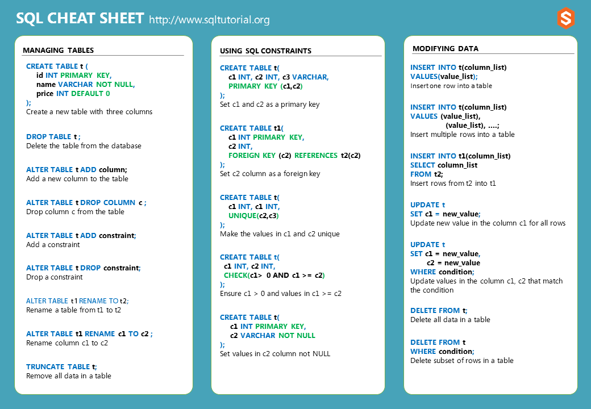

# SQL Annotations

In this repo, you can find many SQL script examples.

The main purpose of this project is to maintain a continuous SQL learning integration.

## Materials

- [Curso em vídeo - MySQL](https://www.youtube.com/playlist?list=PLHz_AreHm4dkBs-795Dsgvau_ekxg8g1r)
- [SQL Cheat Sheet](https://www.sqltutorial.org/sql-cheat-sheet/)

## Tools 

- [MySQL](https://mysql.com/)
- [WampServer](https://www.wampserver.com/en/)
- [ChatGPT](https://chat.openai.com/chat)

## Cheat Sheets

